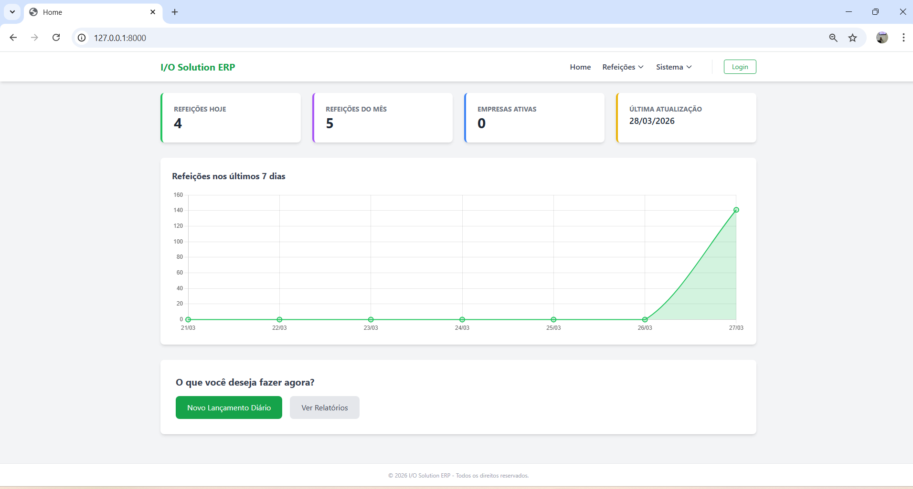
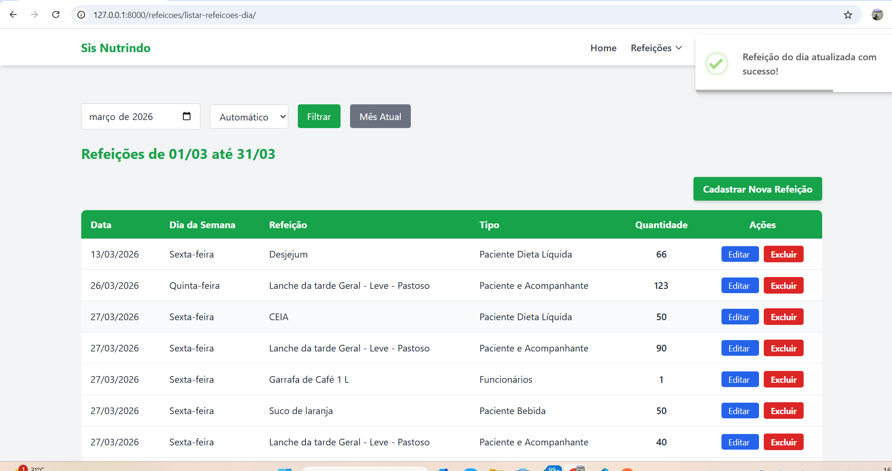
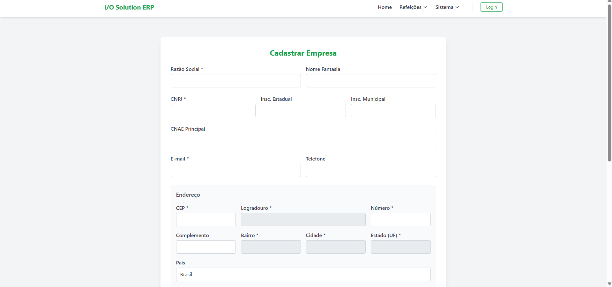

# IO Solution ERP - Módulo de Gestão de Nutrição 🥗

O **IO Solution ERP** é um ecossistema de gestão modular, robusto e escalável. Este repositório apresenta o **Módulo de Nutrição**, desenvolvido para suprir as demandas complexas de Serviços de Nutrição e Dietética (SND) em ambientes hospitalares, industriais e de governança.

O sistema foca na precisão do controle de refeições servidas, segmentando-as por tipo de dieta e público (pacientes, acompanhantes, funcionários), e oferece uma visão analítica em tempo real para tomada de decisão.

---

## 📸 Screenshots & Workflow

### 1. Dashboard Analítico
Visão geral do desempenho do serviço, com KPIs de refeições diárias/mensais e gráfico de tendência dos últimos 7 dias.

 

### 2. Gestão de Base de Refeições
Interface limpa para o cadastro e manutenção do "cardápio" base de refeições do sistema.

 

### 3. Lançamento Diário Dinâmico
Formulário inteligente para registro rápido das refeições servidas no dia, com select dinâmico de tipo e refeição.



---

## ✨ Diferenciais Técnicos & Funcionalidades Sênior

Este projeto não é apenas um CRUD básico. Ele implementa padrões de mercado e funcionalidades avançadas:

- **Integração com API BuscaCEP:** O cadastro de empresas utiliza AJAX/Fetch para consumir a API do ViaCEP. Ao digitar o CEP, os campos de logradouro, bairro, cidade e estado são preenchidos automaticamente, elevando a experiência do usuário (UX) e garantindo a integridade dos dados cadastrais.
- **Gráficos Dinâmicos com Chart.js:** Renderização assíncrona de dados do back-end em gráficos de linha, permitindo análise visual rápida de tendências de consumo.
- **Arquitetura Modular (Django Apps):** O projeto é estruturado em aplicações separadas (`core`, `empresas`, `refeicoes`, `usuarios`), facilitando a manutenção e a escalabilidade do ERP.
- **Context Processors Dinâmicos:** Uso de Context Processors para injetar dados globais (como a empresa Matriz ativa e a marca do sistema) em todos os templates, seguindo o princípio DRY (Don't Repeat Yourself).
- **Interface Moderna com Tailwind CSS:** Design focado em usabilidade e performance, totalmente responsivo.

---

## 🛠️ Tecnologias Utilizadas

### Back-end
- **Python 3.14.0**
- **Django FrameworK:** Core do sistema e ORM robusto.
- **Pytest:** Suíte de testes automatizados unitários e de integração.

### Front-end
- **Tailwind CSS:** Estilização utilitária e responsiva.
- **Chart.js:** Visualização de dados.
- **JavaScript (Vanilla):** Lógica assíncrona (Fetch API) para BuscaCEP e gráficos.

---

## 🚀 Como executar o projeto

1. **Clone o repositório:**
   ```bash
   git clone [https://github.com/kaique-alencar/io-solution-erp.git](https://github.com/kaique-alencar/io-solution-erp.git)